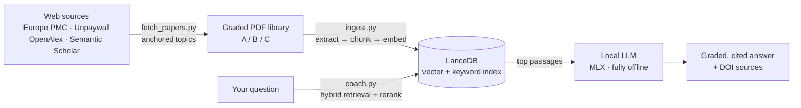
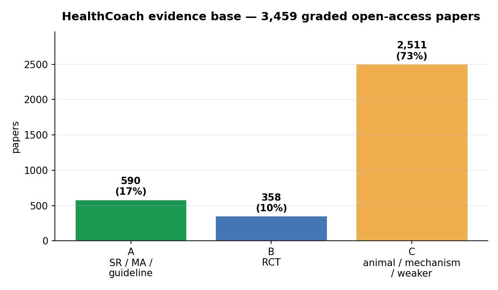
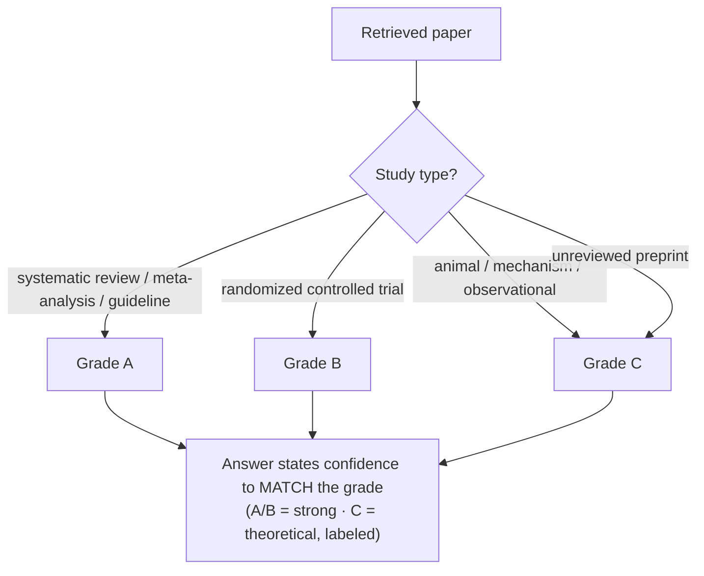
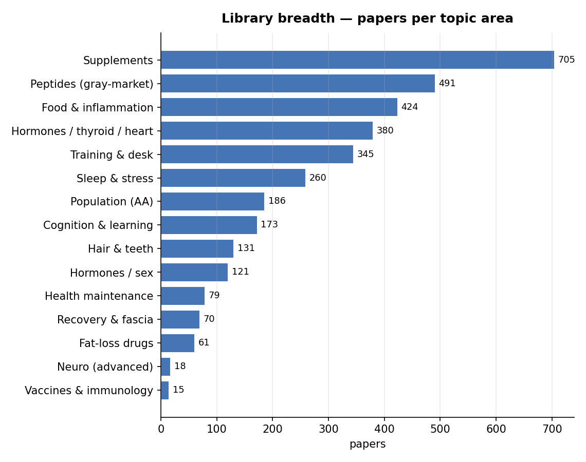
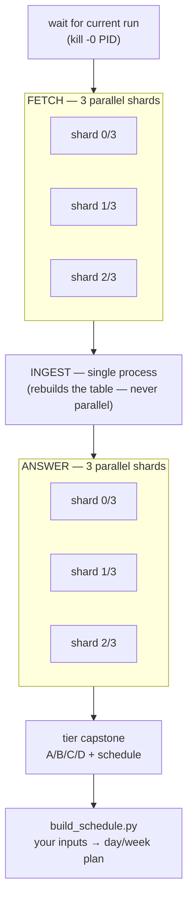

# HealthCoach — runbook

A local, evidence-graded health/performance research engine. It (1) pulls legal open-access
scientific PDFs into a graded library, (2) indexes them into a local vector database, and
(3) answers deep questions with an offline LLM that cites the papers — grading every answer
**A** (systematic review / guideline), **B** (RCT), or **C** (animal / mechanism / weak).
Everything runs on this MacBook. No dosing protocols; safety-first; weak evidence is labeled.

---

## How it works (architecture)



Nothing leaves the machine at answer time — the LLM only sees passages pulled from real,
graded papers, and every claim is tied back to a source with its evidence grade.

## The evidence base (why graded, cited data matters)

The whole point is that answers stand on **real science, ranked by how strong it is** — not an
LLM's memory. Every paper is auto-graded from its study type, and every answer is only as
confident as the grade of the papers behind it.





That C-heavy shape is honest, not a flaw: most of what people ask about supplements and
peptides only *has* animal/mechanism data — the tool shows you that instead of pretending
it's settled. The A/B papers are where firm recommendations come from.



---

## What I'm doing right now (the current run)

A big question run is in progress (`batch_ask.py interactions.txt && questions.txt`).
**Nothing new should touch the vector table until it finishes** — the ingest step rebuilds
that table and would crash a run reading it.

The follow-up pipeline is already queued to start automatically when that run ends. If you
need to launch it fresh, use **Step 2** below.

---

## Step-by-step

### Step 0 — one-time setup (only if `.venv` doesn't exist yet)
```bash
cd ~/GitHub/HealthCoach/rag
python3 -m venv .venv && source .venv/bin/activate
pip install -r requirements.txt
```

### Step 1 — regenerate the question files (only after editing the model)
Run this after changing `build_questions.py` (adds/edits questions & the cross-matrix):
```bash
cd ~/GitHub/HealthCoach/rag && python3 build_questions.py
```
Writes: `interactions.txt` (full set), `new_questions_r15.txt` (just the newest delta),
`personalized_tiers.txt` (the A/B/C/D tier + schedule capstone).

### Step 2 — the full pipeline (fetch → ingest → answer → tiers → schedule)
Run this **only after any in-progress question run has finished**. It parallelizes the two
stages that can be (fetch and answering); ingest runs single-process because it rebuilds the
whole table. Stays awake via `caffeinate`.
```bash
caffeinate -i bash -c '
set -e
cd ~/GitHub/HealthCoach/papers
for i in 0 1 2; do python3 -u fetch_papers.py --shard $i/3 & done; wait
cd ../rag && source .venv/bin/activate
python3 -u ingest.py
for i in 0 1 2; do python3 -u batch_ask.py new_questions_r15.txt $i/3 > logs/qs_shard$i.out 2>&1 & done; wait
MAXTOK=1400 python3 -u batch_ask.py personalized_tiers.txt
MAXTOK=2200 python3 -u build_schedule.py
echo "── ALL DONE ──"
'
```
To auto-start it after a currently-running batch (replace `PID` with the number from `ps -al`):
```bash
while kill -0 PID 2>/dev/null; do sleep 30; done   # then run the block above
```

### Step 3 — build a schedule from YOUR inputs
Edit your must-haves first, then generate:
```bash
cd ~/GitHub/HealthCoach/rag && source .venv/bin/activate
nano schedule_inputs.md          # fill INCORPORATE / TO DO / REMEMBER / REC-LEVEL NOTES
MAXTOK=2200 python3 -u build_schedule.py
```
Output → `logs/schedule_YYYYMMDD_HHMM.md`. The daily clock and weekly split are built
**deterministically in code** from the `## TIMES` and `## WEEKLY SPLIT` fields in
`schedule_inputs.md` — the model can't move your bedtime, invent work hours, or print bad
times; it only writes the rationale/how-to for each block. Sleep length and caffeine cut-off
are computed and sanity-checked, and it flags if you have fewer than 2 lifting days.
Every technical term (zone 2, RPE, protein g/kg…) is defined with a how-to-find-your-number,
and it ends with a **"how to find your numbers"** cheat sheet (curated in `SCHEDULE_TIPS.md`).

### Step 3b — build the full playbook (one learning document)
For the complete report — a multi-chapter learning document, not just a schedule:
```bash
cd ~/GitHub/HealthCoach/rag && source .venv/bin/activate
python3 -u build_playbook.py        # -> logs/playbook_YYYYMMDD_HHMM.md
```
Chapters: (1) how to find your numbers, (2) the foundations that matter most, (3) your daily
schedule, (4) your weekly structure, (5) supplements & compounds tiered A/B/C/D, (6) your first
four weeks — plus a full sources appendix. Everything is written for a beginner and graded.

### Step 4 — read the results
All outputs land in `rag/logs/`:
- `coach_log_*_shard0of3.md` / `1of3` / `2of3` — the new-question answers (merge the three)
- `coach_log_*.md` (from `personalized_tiers.txt`) — the A/B/C/D tier list + schedule capstone
- `schedule_*.md` — your input-driven schedule

Each answer's **Sources** line reads: `[grade] topic (year) — DOI link — filename`.

### Ask a single question interactively (no batch)
```bash
cd ~/GitHub/HealthCoach/rag && source .venv/bin/activate
python3 coach.py "does creatine affect sleep?"
```

---

## Running things in parallel (this M4 Max)



- **Fetch** and **batch_ask** shard by process: `--shard i/n` (fetch) or a trailing `i/n`
  (batch_ask). Run shards `0/3 1/3 2/3` in parallel.
- **Use 3 shards, not more.** Three model copies (~15 GB) fit easily in 48 GB, but all
  shards share one GPU — past 3–4 you oversubscribe with no gain.
- **Ingest is never parallelized** and never overlaps a question run — it drops and rebuilds
  the `chunks` table.
- If a fetch shard starts throwing rate-limit errors, drop to `--shard i/2`.

---

## Choosing / swapping the model (Hugging Face)

The generation model is set by `GEN_MODEL` in `coach.py`, overridable per-run:
`GEN_MODEL=<hf-repo-id> python3 build_playbook.py`. To find a good one on
[huggingface.co/models](https://huggingface.co/models):

**How to search.** In the model search box, filter/query for the pieces that matter:
- **`mlx`** or the **`mlx-community`** org — MLX is the Apple-Silicon runtime `mlx_lm` loads. On a
  Mac, use an MLX build; GGUF (llama.cpp) and safetensors (CUDA) won't load here. Sort by
  **Trending** or **Most downloads** to find the maintained ones.
- a **`4bit`** (or `4bit-DWQ`) quant in the name — 4-bit ≈ 0.5–0.6 GB per billion params. DWQ is a
  higher-quality 4-bit; `8bit` is better quality but ~2× the RAM.
- **`Instruct`** / `-it` / `Chat` — an instruction-tuned model. A base model (no such tag) won't
  follow the prompt. Skip **`VL`**/**`Vision`** (multimodal, heavier) unless you need images, and
  skip **`Coder`** unless it's for code.

**Will it fit 48 GB?** Rule of thumb at 4-bit: model RAM ≈ **params ÷ 2 GB** (a 30B ≈ 15–18 GB,
a 32B ≈ 18–20 GB, a 70B ≈ ~40 GB — too tight here with the RAG stack loaded). Leave ~10 GB for the
embedding + reranker + KV cache + macOS. **MoE models** (name has `A3B`/`A22B` = active params) run
at the speed of their *active* size, so a 30B-A3B reasons big but runs fast — the sweet spot here.
Parallel `batch_ask`/fetch shards each load a full copy, so bigger model = fewer shards
(≈ `40 GB ÷ model-GB`): 8B → 3+ shards, 30B → ~2, 32B dense → 1.

**Verify before committing:** open the repo page, confirm it's MLX (an `mlx` tag or `mlx_lm` in the
snippet), check the file sizes in "Files and versions" against your RAM, and copy the exact repo id
(`org/name`) — that string is what `GEN_MODEL` takes. First run auto-downloads it once.

Known-good picks for this Mac (Sept 2026):
- `mlx-community/Qwen3-30B-A3B-Instruct-2507-4bit` — MoE, fast + strong — **current default**
- `mlx-community/Qwen2.5-14B-Instruct-4bit` — solid, lighter
- `mlx-community/Llama-3.1-8B-Instruct-4bit` — fastest, allows 3 parallel shards

## Adding more later

**More questions / new cross-matrix entities** → edit `rag/build_questions.py`:
- curated blocks: add a `sec("TITLE")` + `add("q1", "q2", ...)`
- auto-crosses: add an entity to `BEHAVIORS`, `SUBS`, or `FOODS` with its outcome ids
  (only where a paper would plausibly find an interaction — else it's empty noise)
- then rerun Step 1.

**More A-grade sources (systematic reviews / meta-analyses / guidelines)** → run the A-hunt pass:
```bash
cd ~/GitHub/HealthCoach/papers
ABOOST=1 python3 fetch_papers.py                 # +8 OA reviews/MA/guidelines/RCTs per topic
ABOOST=1 ABOOST_N=12 python3 fetch_papers.py     # bigger top-up
ABOOST=1 python3 fetch_papers.py --shard 0/3 &   # shard it like a normal fetch
```
It queries each topic for `systematic review / meta-analysis / clinical practice guideline / RCT`,
keeps ONLY anchor-matched **grade A/B**, and is idempotent (dedup skips what's on disk). Re-ingest
after. Note the ceiling: the best A sources (Cochrane full texts, most society guidelines) are
paywalled and this fetcher is legal-OA-only — ABOOST harvests the OA A/B that exist (plentiful in
Frontiers/BMC/PLoS/MDPI/Cochrane-OA). For a specific paywalled review you have legal access to,
drop the PDF into the right `NN_category/topic/` folder named `A_YEAR_slug_title.pdf` and re-ingest.

**More source topics** → edit `papers/fetch_papers.py`:
- add an `ANCHORS['slug'] = [keywords]` gate, then a `T("NN_category/slug", "tag", min, stretch, [queries], aa=False)`
- verify with `python3 fetch_papers.py --selftest`, then fetch (Step 2's fetch line).
- Fetching is idempotent — existing full folders skip; only new/empty ones pull.

---

## File map

**`papers/`**
- `fetch_papers.py` — the fetch engine (Europe PMC + Unpaywall + OpenAlex + Semantic Scholar; anchored topics; A/B/C grading; DOI dedup). `--shard i/n`, `--selftest`, `REFETCH=all|slug`.
- graded PDF library in `NN_category/topic/` folders.

**`rag/`**
- `ingest.py` — extract → chunk → embed (bge-base) → index into `lancedb` (full rebuild each run).
- `coach.py` — models, retrieval, guardrails, system prompt, your `profile.txt`. Single-question CLI. Default model is **Qwen3-30B-A3B-Instruct-2507-4bit** (MoE, ~17 GB, 3B active so it's fast *and* strong; auto-downloads ~17 GB on first run). Lighter: `GEN_MODEL=mlx-community/Qwen2.5-14B-Instruct-4bit python3 …`; fastest / allows 3 shards: `GEN_MODEL=mlx-community/Llama-3.1-8B-Instruct-4bit python3 …`. The prompt forces differentiated A/B/C grading and forbids inventing compound names.
- `batch_ask.py` — runs a question file through the coach → `logs/coach_log_*.md`. Args: `FILE [i/n]`; env `MAXTOK`.
- `build_questions.py` — the question model → `interactions.txt`, `new_questions_r15.txt`, `personalized_tiers.txt`.
- `build_schedule.py` + `schedule_inputs.md` — your input-driven schedule builder (with term definitions + how-to-find-your-number).
- `build_playbook.py` — assembles the full multi-chapter learning document (`logs/playbook_*.md`).
- `SCHEDULE_TIPS.md` — curated "how to find your numbers" reference (zone 2, RPE, protein, TDEE, caffeine cut-off, sleep) injected into the schedule/playbook.
- `history.md` — **optional, git-ignored** personal history (current stack, recent labs, injuries, tried-and-result, trends). If present, the schedule/playbook use it to skip what you already do, avoid failed repeats, and fit your labs. Delete it to opt out.
- `interactions.txt` — full question set. `new_questions_r15.txt` — newest delta (run this, not the whole set).
  `personalized_tiers.txt` — tier + schedule capstone. `questions.txt` — original single-topic deep dives.
- `test_retrieval.py` — fast retrieval sanity check (no LLM).
- `new_cravings_parasites.txt` — **superseded** by `new_questions_r15.txt`; safe to delete.

---

## Guardrails (what the coach will and won't do)

- Cites real papers; never invents authors, years, or doses.
- No self-administration dosing protocols for prescription drugs (e.g. ivermectin/antiparasitics):
  it gives evidence + safety and defers to a clinician.
- Grades every claim A/B/C and says so when only weak evidence exists.
- Answers "nothing in the library covers this" instead of inventing when a topic has no papers.
