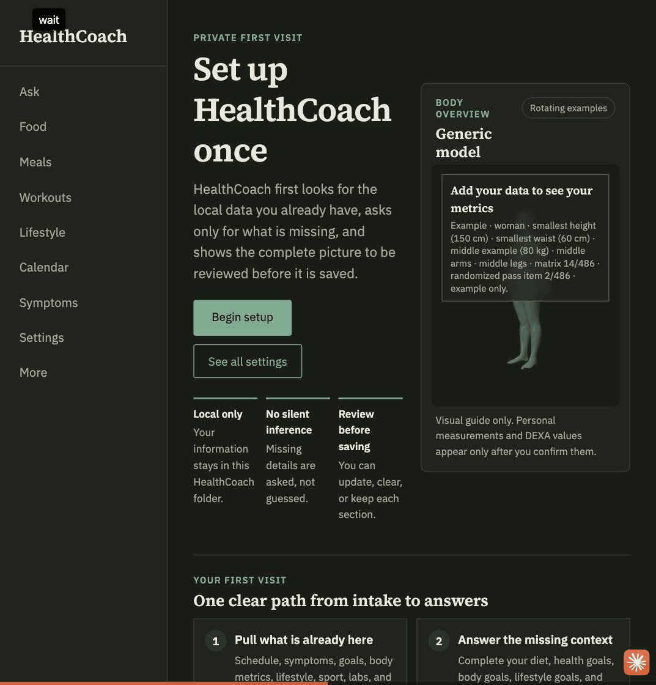
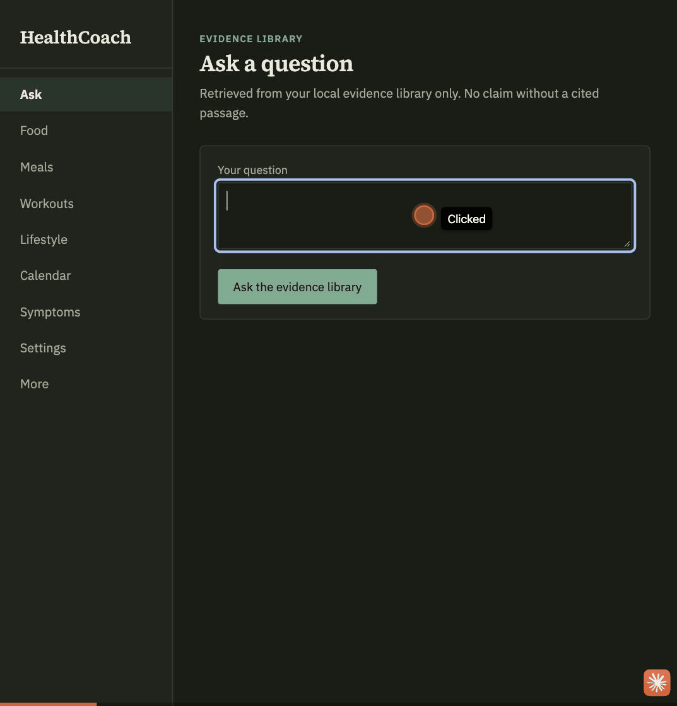
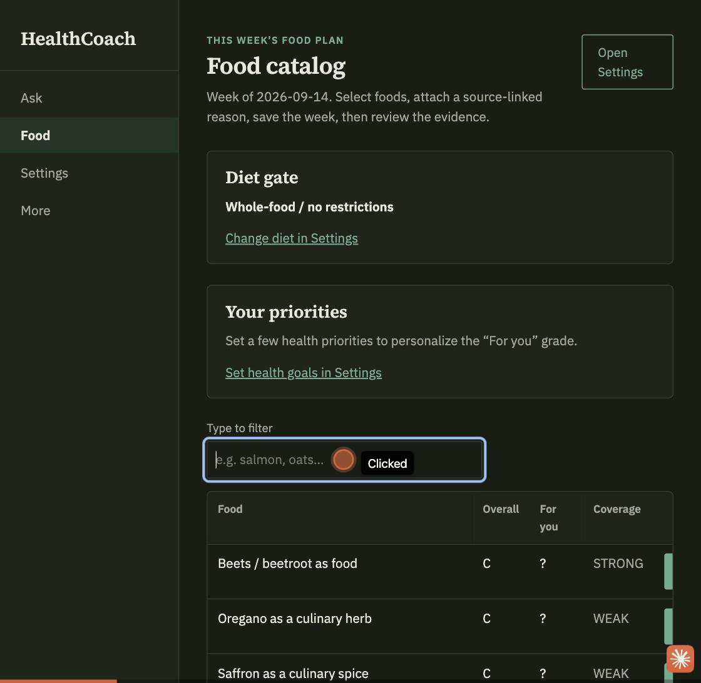
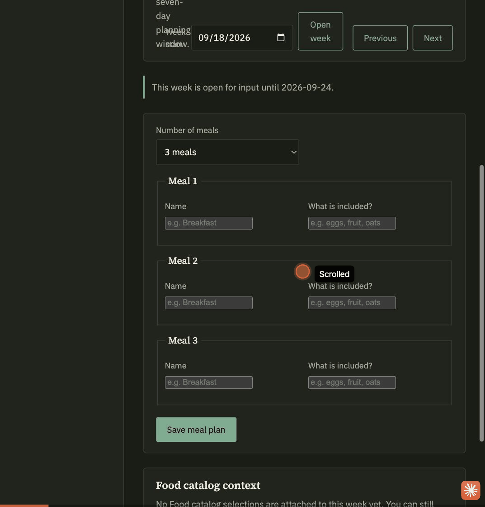
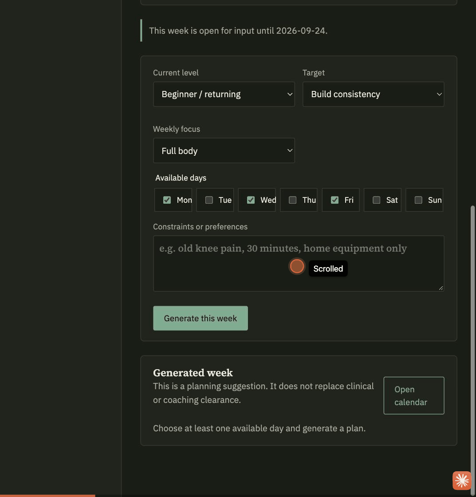
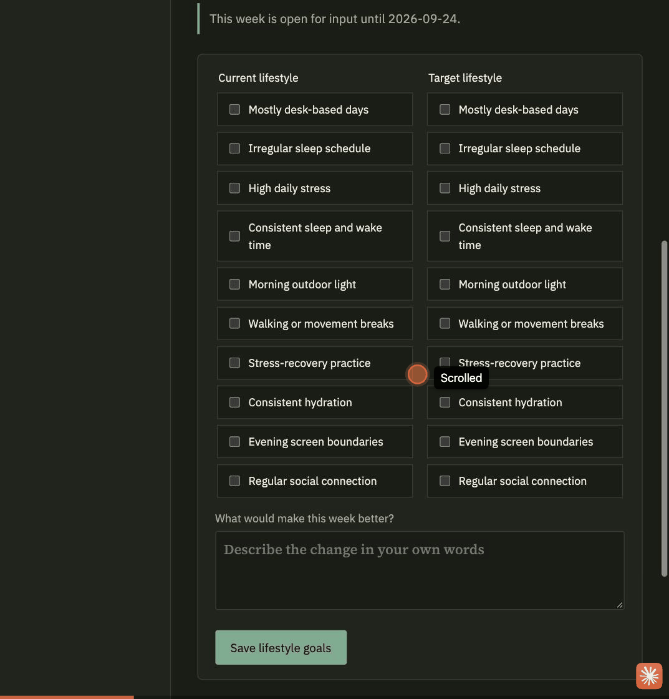
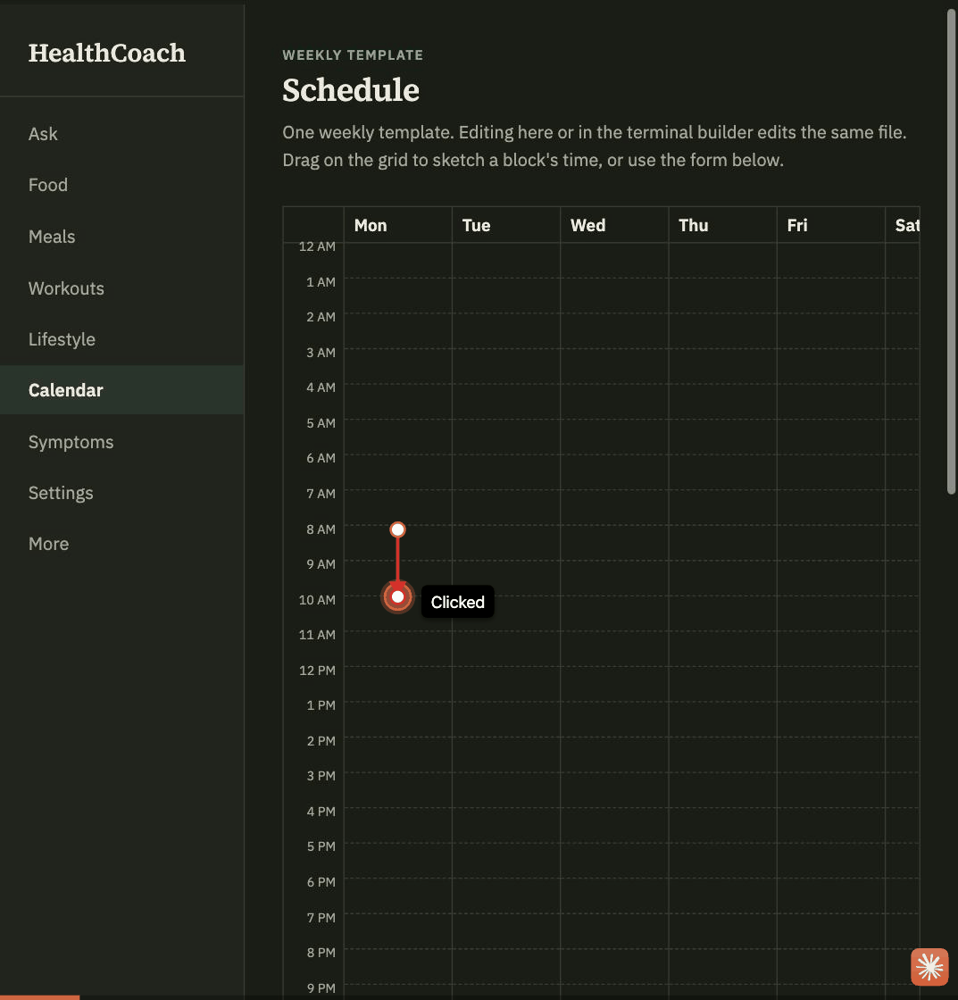
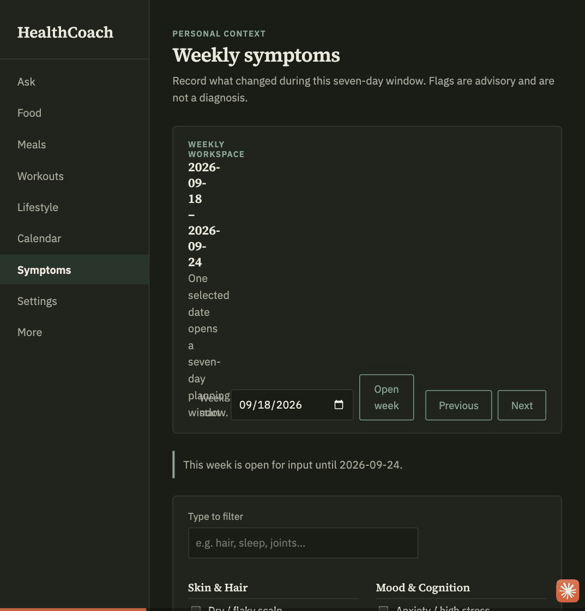
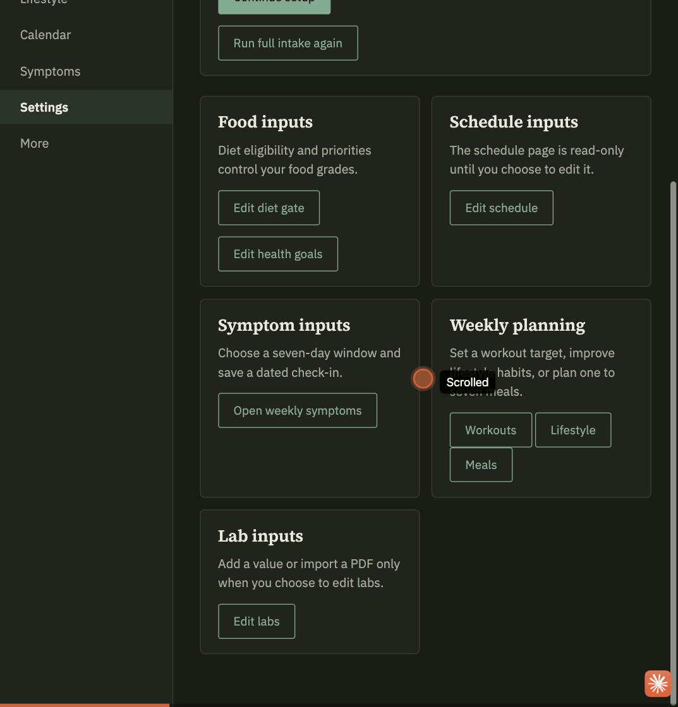
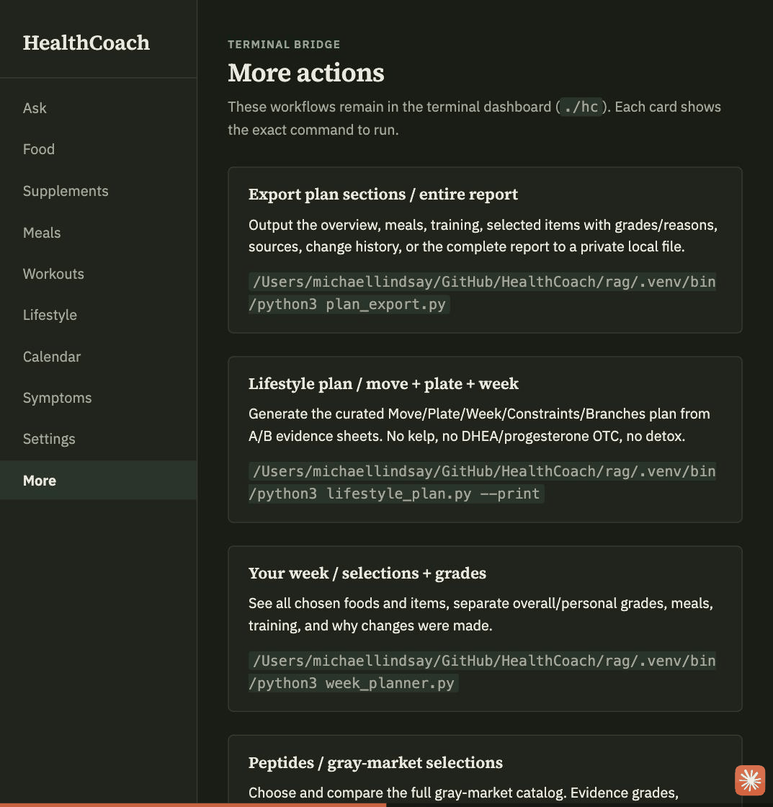

# HealthCoach

📄 **New session, or lost track of a file?** See [`INDEX.md`](INDEX.md) — every doc, log, and
data file in this repo, what it's for, and whether it's safe to touch.

HealthCoach is a local, private personal health planning app built around an evidence-based
decision loop: **plan -> execute -> log -> adjust**. The browser workspace keeps the common
tasks simple; detailed research stays available behind it.

You do not need to understand artificial intelligence, databases, or programming to use it.

## Start here

HealthCoach is currently a source-based app rather than a click-to-install desktop app. The
first setup takes a few copy-and-paste commands. After that, you open the same local browser
page whenever you want to plan, log, or review your week.

### 1. Download the project

On GitHub, click **Code -> Download ZIP**, unzip the download, and place the `HealthCoach`
folder somewhere easy to find. You can also clone the repository if you already use Git.

### 2. Check the platform notes

| Platform | Browser workspace | Local AI answers | Recommended path |
|---|---|---|---|
| macOS with Apple Silicon | Supported | Supported by the default MLX setup | Use `./hc-web` or the Python command below |
| Windows | The Flask browser workspace may run when dependencies install | The default MLX runtime is not currently a turnkey Windows path | Use the Windows command below; see the portability note if installation fails |
| Linux | The Flask browser workspace may run when dependencies install | The default MLX runtime is not currently a turnkey Linux path | Use the Linux command below; see the portability note if installation fails |

The current local model path uses `mlx-lm`, which is optimized for Apple Silicon. Windows and
Linux support is therefore not yet equivalent to the macOS path: the planning forms and browser
UI may be usable, but model-backed answers require a compatible runtime change. See the
[portability notes](docs/PROJECT_AI_HANDOFF.md) before troubleshooting a failed install. If
`pip` fails while installing `mlx-lm` on Windows or Linux, that is the known runtime limitation,
not a mistake in the copy-and-paste commands.

### 3. Install once

Open a terminal in the unzipped project:

- **macOS:** open **Terminal** from Spotlight (`Command + Space`).
- **Windows:** open **PowerShell** from the Start menu.
- **Linux:** open **Terminal** from the applications menu.

If you do not know the folder path, type `cd ` (with a space) and drag the `HealthCoach` folder
into the terminal window, then press Enter.

#### macOS or Linux

```bash
cd /path/to/HealthCoach/rag
python3 -m venv .venv
source .venv/bin/activate
python3 -m pip install -r requirements.txt
```

#### Windows PowerShell

```powershell
cd C:\path\to\HealthCoach\rag
py -m venv .venv
.\.venv\Scripts\python.exe -m pip install -r requirements.txt
```

Replace `/path/to/HealthCoach` or `C:\path\to\HealthCoach` with the real location on your
computer. You only need to repeat the install command when the dependencies change.

### 4. Open the browser workspace

Keep the terminal window open while HealthCoach is running.

On macOS or Linux:

```bash
cd /path/to/HealthCoach/rag
source .venv/bin/activate
./hc-web
```

On Windows PowerShell:

```powershell
cd C:\path\to\HealthCoach\rag
.\.venv\Scripts\python.exe -m webapp.app
```

Open [http://127.0.0.1:5231/](http://127.0.0.1:5231/) if the browser does not open by itself.
To stop the app, return to the terminal and press `Ctrl+C`.

### 5. Use the sidebar

The browser workspace gives you one place to:

- choose a weekly check-in date and enter symptoms during its seven-day window;
- build a weekly workout schedule and get practical training suggestions;
- record current and target lifestyle habits and receive change ideas;
- enter calendar details, food choices, and one to seven meals for analysis;
- review the combined analysis and see what to adjust next; and
- open Labs, Ask, Settings, and the evidence-backed report when needed.

Start with **Settings**, then choose a date. The sidebar keeps **Symptoms**, **Workouts**,
**Lifestyle**, **Calendar**, **Foods**, and **Meals** easy to find. You can return to the same
week later; the app saves the planning data locally on your computer.

If you only want the terminal dashboard on macOS, continue to the optional instructions below.

**Weekly choices are directly accessible:** `f` Foods, `g` Peptides/Gray Market, `n`
Nootropics, `s` Supplements, `m` Meals, `t` Training, and `e` Export from the home dashboard.
Each new choice needs a source-linked hard reason, not just a high grade. See
[Weekly Workspace](docs/WEEKLY_WORKSPACE.md) for selection, day-by-day editing, and full-report exports.

The browser workspace is the recommended starting point. The optional terminal dashboard is
available on macOS for **Today**, **Plan**, **Log/Review**, **Research**, and **Maintenance**.
Supplements, peptides, nootropics, and gray-market topics remain in the research catalog with
source-linked reviews. Research visibility and reported use are not automatic permission to
add an item to the active plan.

See [Today And Trust](docs/TODAY_AND_TRUST.md) for the implemented boundaries, commands,
verification workflow, and remaining limitations. This is decision support, not medical clearance.

## Video walkthrough

HealthCoach also has a local browser GUI (`./hc-web`, see [`rag/README.md`](rag/README.md#a-browser-gui-for-weekly-planning))
for the most-used flows.

▶ **[Watch the full walkthrough](demo/healthcoach-walkthrough.mp4)** (~85s, silent, with title
cards for each section) — or browse the individual clips below, one per feature.

| | |
|---|---|
| **Setup & body model**<br>Private-first setup and the rotating anthropometric body model.<br> | **Ask**<br>Ask a question and get a sourced answer from the local evidence library.<br> |
| **Food**<br>Filter the food catalog and attach a source-linked reason before selecting.<br> | **Meals**<br>Add one to seven meals and review the week alongside selected foods.<br> |
| **Workouts**<br>Generate a weekly workout plan and review practical recommendations.<br> | **Lifestyle**<br>Compare current and target habits, then analyze the change plan.<br> |
| **Calendar**<br>Build a weekly schedule and review evidence before exporting it.<br> | **Symptoms**<br>Complete the date-based weekly symptom check-in.<br> |
| **Settings & labs**<br>Update the control center and add or import lab values.<br> | **More**<br>The terminal bridge — every deeper `./hc` workflow, one command away.<br> |

## The concept

Most health information arrives as disconnected pieces: one workout from a video, one food
rule from a podcast, one supplement claim from a store, and a different answer every time an
AI is asked. Those pieces may ignore the person's schedule, medications, injuries, existing
stack, recovery, or the other recommendations already in the plan.

HealthCoach turns those scattered decisions into one repeatable process:

```text
Your selections
      ↓
Relevant passages from the local research library
      ↓
Duplicate and off-topic checks
      ↓
Evidence strength, personal fit, and safety gates
      ↓
One practical report with the plan and its references
```

The user remains in control. Selecting a food, supplement, peptide, training time, store, or
lifestyle idea means “research and evaluate this,” not “automatically recommend this.” The
compiler can keep it, make it optional, require clinician review, or explain why it should be
skipped.

## Why this is a big deal

- **It connects the decisions.** Training, food, sleep, supplements, medications, shopping,
  schedule, and recovery are evaluated as parts of the same plan instead of separate answers.
- **It shows its work.** The report keeps the questions, recorded answers, evidence grades,
  source folders, and available DOI references beside the conclusions.
- **It admits uncertainty.** Weak, indirect, animal-only, missing, and off-topic evidence is
  labeled instead of silently being turned into confident advice.
- **It produces something usable.** Research is converted into a weekly schedule, shopping
  strategy, meal structure, decision tables, safety gates, and skip rules.
- **It is personal without hiding the basis.** The user selects goals, constraints, current
  products, preferred stores, and topics to investigate; the research still controls health
  claims.
- **It stays manageable.** Today is a small daily view; the organized report remains the
  durable reference, with private decisions and daily facts stored separately.
- **It is easy to navigate.** A keyboard index can search titles or paragraph text and open a
  selected logical page with Space, so a long evidence report does not have to be read linearly.
- **It runs locally after setup.** The paper search, evidence matching, and report generation
  happen on your computer once the required models are available. The default local model
  runtime is currently optimized for Apple Silicon.

HealthCoach is not automatically correct merely because it cites papers. Its quality still
depends on the papers in the library, retrieval accuracy, source quality, and human review.
That is why the report exposes gaps and references instead of presenting itself as a doctor.

## What you receive

HealthCoach keeps its rendered reference report at:

```text
rag/HEALTHCOACH_REPORT.md
```

Private candidate decisions and explicit daily logs live under `rag/.healthcoach/`.
Opening Today does not rewrite these files or regenerate the report. Existing report,
profile, and schedule files may be tracked by Git; local execution alone does not keep
them out of commits or external shares.

The report contains:

- your weekly training and recovery schedule;
- a practical food plan based on every store you are willing to use;
- supplement recommendations and items to skip;
- safety warnings and questions for a clinician;
- apartment and house options;
- a faith and Bible-study section when selected;
- links and references showing where the information came from; and
- a clickable chapter and page index.

Running HealthCoach again replaces the previous report. It does not create a folder full of
extra reports.

## Optional: terminal dashboard (macOS only)

### 1. Open Terminal

On a Mac, press `Command + Space`, type `Terminal`, and press Enter.

### 2. Copy and paste these commands

```bash
cd ~/GitHub/HealthCoach/rag
./hc
```

The launcher keeps the Mac awake while HealthCoach works. Use `l` to log today, `w` to
review the completed week, or Tab / `1`-`5` to switch areas. Research remains available in
its own area, including experimental-source refreshes.

### 3. Review your plan when needed

Choose **Plan -> Review My Plan** to open the full assessment. It is no longer the first
screen on every launch. Old plans without a saved session snapshot show only their
recorded calendar placement until the plan is reviewed and saved again.

HealthCoach explains nine short sections one at a time:

1. Goals and current activity.
2. Training schedule and injuries.
3. Supplements currently being used and their results.
4. Medicines, confirmed deficiencies, reactions, and safety concerns.
5. Supplements to investigate.
6. Peptides or gray-market items to investigate—not automatically use.
7. Food, digestion, sleep, caffeine, and substances.
8. Food, home, faith, and alternative-health ideas to evaluate.
9. Stores, buying preferences, and deadlines.

- Use the arrow keys to move.
- Press Space to select or unselect something.
- Press `/` to search longer lists.
- Press `r` to return to that section's complete list.
- Press Enter to continue to the next section.

Each screen explains what its answers change. Useful choices are already checked, so pressing
Enter keeps them. At the end, HealthCoach shows a readable summary and lets you generate the
report, restart the assessment, or cancel without changing the current report.

The `STORE / MULTI` section includes Costco, Whole Foods, Sam's Club, H-E-B, Walmart,
Sprouts, Trader Joe's, pharmacies, supplement shops, online stores, and more. Select as many
as you are willing to use. The report uses those choices for sourcing; no chain is required.

HealthCoach only asks for a short typed explanation when a choice cannot be understood safely,
such as an injury, another medication, an abnormal lab result, or a supplement reaction. All
needed details are collected in one short line rather than a long interview.

### 4. Wait for the report

The first run can be slower because the Mac may need to download the local language model.
Later runs reuse it. Leave Terminal open until HealthCoach says the report is complete.

### 5. Browse the report

```bash
./hc-report
```

Use the arrow keys to choose a chapter. Press Space or Enter to open it. Press Space again to
move down one screen, `b` to return to the chapter index, `[` or `]` to change chapters, and
`q` to quit. Press `/` at the index to search both chapter titles and paragraph text.

For a direct lookup without the interactive screen:

```bash
./hc-report --search "raw milk"
./hc-report --page 017
```

To open the complete static file in a Mac application:

```bash
open HEALTHCOACH_REPORT.md
```

For a cleaner Terminal reading view, install Glow once and then use it:

```bash
brew install glow
glow -p HEALTHCOACH_REPORT.md
```

## What HealthCoach is doing

In plain language:

1. You select your goals, current supplements, health concerns, foods, preferred habits, and every store you are willing to search.
2. HealthCoach searches the research papers stored on your Mac.
3. It removes duplicate sources and checks how directly each source fits your question.
4. It labels strong, weak, missing, and indirect evidence instead of pretending every idea is
   proven.
5. It creates one organized report with chapters, logical page numbers, recommendations,
   cautions, and source references.

The report is generated locally after the required models have been downloaded. It is a
research and planning tool, not a doctor, prescription service, or medical diagnosis.

## Common commands

Run the normal guided assessment:

```bash
cd ~/GitHub/HealthCoach/rag
caffeinate -i ./hc-supplements
```

Use the longer assessment when exact dates, doses, mileage, and symptom details are needed:

```bash
./hc-supplements --detailed-assessment
```

See the available stores, food, home, faith, and alternative-health choices:

```bash
./hc-supplements --list-lifestyle
```

Ask one research question without rebuilding the full report:

```bash
python3 coach.py "Does creatine affect sleep?"
```

Use **DEEP INTAKE / RANK / ADD / DECIDE / INSPECT** in `./hc` to confirm ranking context and
maintain the private candidate ledger. Every ranking run scans the configured supplements,
foods, peptides, nootropics, and gray-market topics. Selected rows remain visible even when
coverage is `NONE`; only an explicit `adopt` decision or `use_status=in_use` can put a candidate
on the generated week overlay.

Recommended order: run **DEEP INTAKE / RANK / ADD / DECIDE / INSPECT** first, choose
`deep_intake`, then run **START / UPDATE PLAN + RUN FULL RANKING**. The second action scans the
entire configured catalog and offers up to the saved follow-up cap without auto-adopting rank 1.

Refresh the focused evidence folders for ALCAR, citicoline, uridine, Noopept, and bromantane,
then rebuild and test the search index:

```bash
caffeinate -i ./hc-refresh-nootropics
```

When Bible/Jesus study is selected in the assessment, the report assigns 04:50–05:15 to its
eight-week reading-and-prayer path and keeps 05:15–05:50 for Anki or technical study.

## Advanced: installing or repairing the environment

The beginner setup near the top of this page is the same installation. Use these commands if
you skipped it, deleted `.venv`, or need to repair the environment.

On macOS or Linux:

```bash
cd /path/to/HealthCoach/rag
python3 -m venv .venv
source .venv/bin/activate
python3 -m pip install -r requirements.txt
```

On Windows PowerShell:

```powershell
cd C:\path\to\HealthCoach\rag
py -m venv .venv
.\.venv\Scripts\python.exe -m pip install -r requirements.txt
```

The `hc-supplements` command activates the macOS/Linux environment automatically during normal
use. Windows users should run the Python executable inside `.venv\Scripts` as shown above.

## Updating the research library

You do not need to update the research library every time you create a report. Update it only
after adding or downloading new papers. The refresh commands below are the advanced macOS/Linux
workflow; the default local model and paper-refresh path are not currently a turnkey Windows
workflow.

```bash
cd ~/GitHub/HealthCoach/papers
caffeinate -i env ABOOST=1 python3 fetch_papers.py

cd ../rag
source .venv/bin/activate
python3 ingest.py
python3 test_retrieval.py
```

This does three things: downloads legal open-access research, rebuilds the searchable local
library, and checks that important questions retrieve appropriate papers.

Do not close Terminal during `ingest.py`. It intentionally replaces the old search index with
the newly rebuilt one.

## Important safety limits

- Selecting an item means “research this,” not “recommend this.”
- The program does not change prescription doses.
- It does not provide personal protocols for gray-market peptides or unapproved drugs.
- Weak, animal-only, or irrelevant evidence cannot become a strong recommendation.
- Deficiency-dependent supplements remain behind diet, laboratory, or clinician checks.
- Home IVs, coffee enemas, raw milk, detox clay, and unsupported frequency treatments are not
  approved simply because they appear in the assessment.

## Where to find more detail

- Beginner and troubleshooting notes: [`rag/README.md`](rag/README.md)
- Full technical explanation for another engineer or AI: [`docs/PROJECT_AI_HANDOFF.md`](docs/PROJECT_AI_HANDOFF.md)
- The generated report: [`rag/HEALTHCOACH_REPORT.md`](rag/HEALTHCOACH_REPORT.md)
