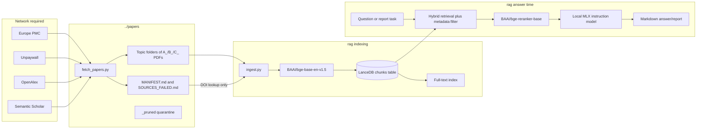

# HealthCoach: dense technical analysis and AI handoff

**Inspection snapshot:** 2026-09-03, from `/Users/michaellindsay/GitHub/HealthCoach/rag` on branch `main` at commit `eeb1124`, with uncommitted work present.
**Scope:** the entire `HealthCoach` repository, emphasizing `rag/` and its dependency on `../papers/`.
**Audience:** another AI or engineer who must operate, debug, or extend the project without rediscovering it first.
**Important:** this describes both the intended design and the implementation. Where they differ, implemented behavior is stated explicitly.

**Absolute handoff path:** `/Users/michaellindsay/GitHub/HealthCoach/rag/PROJECT_AI_HANDOFF.md`
**Current print-ready week:** `/Users/michaellindsay/GitHub/HealthCoach/rag/WEEK_OPERATING_PLAN.md`

---

## 1. Executive summary

HealthCoach is a personal, local-first research and report-generation system for health, nutrition, training, cognition, supplements, hormones, and related topics. Its interface is a set of Python command-line tools. It is not a web app, API service, trained health model, or validated clinical decision-support system.

The project has two major halves:

1. **Research-library acquisition (`papers/`)** searches legal open-access sources, downloads PDFs, assigns a heuristic evidence grade, files papers into topic directories, records provenance in a Markdown manifest, and reuses duplicate papers through hardlinks where possible.
2. **Retrieval and generation (`rag/`)** extracts text from those PDFs, chunks and embeds it, stores it in LanceDB, retrieves passages with dense plus full-text search, reranks with a cross-encoder, and asks a local MLX language model to generate an answer or larger personal report.

The same core supports:

- one-off CLI answers (`coach.py`);
- resumable question-bank runs (`batch_ask.py`);
- thematic evidence briefs (`deep_dive.py`);
- a deterministic-clock personal schedule with LLM-written rationale (`build_schedule.py`);
- a six-chapter personal playbook (`build_playbook.py`);
- an interactive 89-item supplement evidence audit (`supplement_audit.py` / `hc-supplements`);
- a combined master Markdown report (`combine_report.py`).

The project is strongly personalized. `profile.txt` is injected into every generated answer. `schedule_inputs.md` supplies fixed schedule anchors and preferences. Optional `history.md` is injected into schedules and playbooks. Those tracked inputs currently describe a mid-20s embedded software engineer moving from Seattle to Dallas, working a compressed four-day/ten-hour schedule, using tirzepatide while cutting, lifting and running, studying in the morning, and training in the evening. They are now stale relative to the later user-locked execution specification described below.

`WEEK_OPERATING_PLAN.md` is the current manual execution artifact. For that document only, the later locked specification governs: Black male, age 26, currently in Dallas; about 230 lb; Phase A to 200 lb and Phase B to 190 lb; 165 g/day protein during Phase A; three lifting days; running primary; biking as easy additional volume or a run substitute; and one Thursday aerobic-quality session. The artifact was compiled directly from the user's constraints, not generated by `build_schedule.py` or RAG.

At answer time, inference is local once all models are cached. Paper acquisition and first-time model downloads require the network. The repository assumes Apple Silicon, Metal/MPS, MLX, and roughly 48 GB unified memory. Linux, CUDA, Windows, and CPU-only portability are not implemented.

This is a capable personal research prototype, but it is not medically validated. Its main limitations are retrieval without a relevance threshold, duplicate evidence, heuristic study grading, inconsistent enforcement of stated dosing/safety rules, and LLM-authored claim grading that is not programmatically checked.

---

## 2. Architecture



The critical trust boundary is: the PDF library is treated as evidence, filename/manifest data supplies metadata, and the LLM is supposed to synthesize retrieved passages. “Supposed to” is prompt-level behavior, not proof. There is no claim-level entailment validator, citation verifier, or medical review.

---

## 3. Current live state

These values were measured during inspection and will drift after future fetches, ingests, or generation.

### Repository and storage

- Git branch: `main`.
- HEAD: `eeb1124` (`session updates`).
- Tracked files before this handoff: 32.
- The current worktree has 15 modified/untracked paths, including active user work and the two handoff artifacts. Do not reset it.
- `../papers`: about **7.9 GB**.
- `rag/lancedb`: about **672 MB**.
- `rag/logs`: about **24 MB**.
- `rag/.venv`: about **1.5 GB**.
- Hugging Face cache: about **29 GB**, outside the repo at `~/.cache/huggingface/hub`.

The dirty paths observed after the operating-week artifact was added were:

```text
M  README.md
M  RESUME.md
M  papers/MANIFEST.md
M  papers/SOURCES_FAILED.md
M  papers/fetch_papers.py
M  rag/batch_ask.py
M  rag/build_playbook.py
M  rag/build_questions.py
M  rag/build_schedule.py
M  rag/schedule_inputs.md
?? rag/combine_report.py
?? rag/new_questions_r16.txt
?? rag/organize_logs.py
?? rag/PROJECT_AI_HANDOFF.md
?? rag/WEEK_OPERATING_PLAN.md
```

`rag/PROJECT_AI_HANDOFF.md` and `rag/WEEK_OPERATING_PLAN.md` are the only files added by this handoff work. Existing modified and untracked files belong to the user.

### Paper corpus

- Live, non-pruned PDF paths: **4,376**.
- Unique live file inodes: **4,004**.
- The remaining **372 paths** are additional hardlink locations for reused papers.
- Quarantined PDFs under `_pruned`: **668**.
- Total PDFs including quarantine: **5,044**.
- Live filename grades: **1,093 A**, **515 B**, **2,768 C**, **0 D**.
- Configured topic folders: **237** total (223 main plus 14 hormone/thyroid/heart side-job topics).
- `00_foundations` currently contains no live PDFs.

| Top-level category | Live PDF paths |
|---|---:|
| `00_foundations` | 0 |
| `01_food_inflammation` | 557 |
| `02_training_desk` | 455 |
| `03_sleep_stress` | 336 |
| `04_cognition_learning` | 218 |
| `05_fat_loss_drugs` | 100 |
| `06_hair_teeth` | 154 |
| `07_supplements` | 816 |
| `08_peptides_gray` | 587 |
| `09_hormones_sex` | 152 |
| `10_recovery_fascia` | 110 |
| `11_neuro_advanced` | 27 |
| `12_population_AA` | 194 |
| `13_vaccines_immunology` | 49 |
| `14_hormones_thyroid_heart` | 409 |
| `15_health_maintenance` | 212 |

### Vector database

- LanceDB table: `chunks`, observed table version 2.
- Rows/chunks: **131,456**.
- Distinct indexed `source_pdf` paths: **4,369**. Seven live paths did not become indexed sources, probably because extraction failed or produced too little text.
- Chunk grades: **28,822 A**, **10,608 B**, **92,026 C**, **0 D**.
- Cohorts: **129,984 general**, **1,472 older**.
- `allow_c=true`: **18,293 chunks**.
- Full-text index: active for all rows, about 71.7 MB.
- No ANN/vector index was listed. Dense retrieval appears to scan stored vectors rather than use IVF/HNSW.

| Top-level category | Indexed chunks |
|---|---:|
| `02_training_desk` | 26,405 |
| `14_hormones_thyroid_heart` | 19,651 |
| `07_supplements` | 18,665 |
| `08_peptides_gray` | 15,367 |
| `01_food_inflammation` | 13,775 |
| `03_sleep_stress` | 8,023 |
| `12_population_AA` | 5,389 |
| `04_cognition_learning` | 5,318 |
| `15_health_maintenance` | 5,177 |
| `06_hair_teeth` | 3,288 |
| `09_hormones_sex` | 3,171 |
| `10_recovery_fascia` | 2,788 |
| `05_fat_loss_drugs` | 2,356 |
| `13_vaccines_immunology` | 1,405 |
| `11_neuro_advanced` | 678 |

### Generated material

- Current flat master report: `logs/MASTER_REPORT_20260902_2323.md`, about **4.29 MB**, **44,084 lines**, and **1,366 compiled Q&A answers**, plus playbook and tier content.
- Latest inspected playbook contains six chapters and used the default Qwen3 model.
- Latest inspected tier file contains 14 prompts.
- Newest inspected Round-16 batch log is incomplete: **52 of 93 current questions**, leaving 41 unanswered.
- `combine_report.py` leaves the newest master in the root of `logs/`; the next run moves the prior master to `logs/reports/`.
- `WEEK_OPERATING_PLAN.md` is a manually compiled, 496-line print-ready Monday–Sunday execution plan. It is not in `logs/`, was not produced by RAG, and should not be treated as evidence output.

### Generated question drift

The artifacts do not all match current `build_questions.py`:

| Artifact | On disk | Current generator would write |
|---|---:|---:|
| `interactions.txt` | 655 questions, 28 sections | 915 questions, 52 sections |
| `new_questions_r15.txt` | 167 questions | 168 questions |
| `new_questions_r16.txt` | 93 questions | 93 questions |
| `personalized_tiers.txt` | 14 questions | 14 questions |

Expected counts were measured by running the generator in a temporary directory, without overwriting user files. Running `python3 build_questions.py` in `rag/` now will materially rewrite `interactions.txt` and delta files.

---

## 4. Repository map

### Top-level `HealthCoach/`

| Path | Responsibility |
|---|---|
| `README.md` | Broad runbook. More current than `rag/README.md`, but some count/concurrency claims are stale. |
| `RESUME.md` | Session checkpoint and pending-work notes, not timeless design. |
| `.gitignore` | Excludes PDFs, DB, logs, venvs, caches, model artifacts, and personal history. |
| `papers/` | Acquisition code, provenance, topic hierarchy, live PDFs, quarantine. |
| `rag/` | Indexing, retrieval, generation, personalization, reporting. |
| `docs/` | README visualization assets. |
| `adapters/`, `chunks/`, `clean/`, `eval/`, `index/`, `lora/` | Empty/placeholders or ignored experiments; not in the active path. |

### `papers/`

| File/path | Responsibility |
|---|---|
| `fetch_papers.py` | 1,895-line standard-library acquisition engine and topic catalog. |
| `MANIFEST.md` | Provenance table plus human policy text. Ingest reads only its filename-to-DOI mapping. |
| `SOURCES_FAILED.md` | Rejections/failures: API, no PDF, off-topic, detox, etc. |
| `PRUNE_LOG.md` | Audit trail for reversible quarantine moves. |
| `_pruned/` | Excluded quarantine. |
| `00_...` through `15_...` | Nested topic folders and grade-prefixed PDFs. |
| `README.md` | Acquisition guide; some usage text predates current code. |
| `status.sh`, `dash.sh` | Local status dashboards. |
| `fetch_curated.sh`, `curated_seed_list.csv` | Older/manual source bootstrap. |

### `rag/`

| File/path | Responsibility |
|---|---|
| `ingest.py` | Full PDF-to-LanceDB rebuild. |
| `coach.py` | Canonical retrieval, reranker, model choice, system prompt, profile, single-question CLI. |
| `test_retrieval.py` | Four-query no-LLM wiring smoke test. |
| `batch_ask.py` | Batch/resume/shard answering to Markdown. |
| `deep_dive.py` | Multi-query thematic synthesis. |
| `build_questions.py` | Code-generated taxonomy and banks; rewrites files even when imported. |
| `questions.txt` | Original manual bank: 250 questions in 34 sections. |
| `interactions.txt` | Broad generated bank; currently stale. |
| `new_questions_r15.txt`, `new_questions_r16.txt` | Generated delta banks. |
| `personalized_tiers.txt` | Fourteen capstone tier/schedule questions. |
| `themes.txt` | Custom extra deep-dive themes using `::`, `focus:`, `q:` syntax. |
| `build_schedule.py` | Fixed clock/split plus generated rationale/details. |
| `schedule_inputs.md` | Fixed times, split, requirements, constraints. |
| `SCHEDULE_TIPS.md` | Hand-authored reference copied into outputs; not RAG-derived. |
| `WEEK_OPERATING_PLAN.md` | Current user-locked print-ready week; manually compiled, not generated by the schedule builder. |
| `supplement_audit.py` | Interactive issue intake, scoped retrieval, DOI/source de-duplication, coverage gates, capped shortlist, and source-bound deep cards. |
| `hc-supplements` | Executable launcher that activates the project venv and runs the supplement audit. |
| `build_playbook.py` | Six-chapter report, reusing schedule helpers. |
| `profile.txt` | Tracked personal profile injected into all answers. |
| `history.md` | Ignored optional history injected into schedule/playbook; currently contains placeholders. |
| `organize_logs.py` | Classifies flat outputs into typed folders. |
| `combine_report.py` | Organizes logs and writes master report. |
| `logs/`, `lancedb/` | Generated, ignored output/state. |
| `_deprecated_matrix/` | Retired pairwise experiment; no live references. |
| `queue_more.sh`, `queue_remake.sh` | Older orchestration scripts with hardcoded paths/stale comments. |
| `setup_aliases.sh` | Installs convenience commands into `~/.zshrc`. |
| `migrate_to_ssd.sh` | APFS/HFS copy preserving hardlinks; rebuilds destination venv. |
| `INGEST_RULES.md` | Intended policy, not executable by itself. |
| `requirements.txt` | Broad minimum dependencies, not a lockfile. |

---

## 5. Paper acquisition: exact behavior

`papers/fetch_papers.py` is a standard-library downloader. Topic definitions are code, not configuration data.

### Provider flow

For every topic, it executes hardcoded queries. It starts with Europe PMC and, if below stretch target, widens to OpenAlex and Semantic Scholar. Records normalize title, year, DOI, PMCID, abstract, publication types, source, and direct PDF URL.

PDF candidates are tried in order:

1. direct OA URL from OpenAlex/Semantic Scholar;
2. Europe PMC OA render for PMCID;
3. Europe PMC full-text PDF endpoint;
4. Unpaywall best OA PDF;
5. alternate Unpaywall OA PDFs.

The response must begin `%PDF-`. The code trusts provider OA metadata; it does not independently verify licenses. It intentionally avoids Sci-Hub/paywall bypass.

### Topic configuration

Each topic has destination folder, filename slug, minimum/stretch quotas, queries, optional seeds, optional population overlay, optional hardlink destinations, and optional cohort detection. The 223 main-topic quotas sum to 1,564 minimum and 3,329 stretch paths; actual corpus size is larger due to side jobs, overlays, refetches, and reuse.

The catalog is uneven by design: 72 supplement folders and 46 peptide/gray-market folders dominate, followed by food/inflammation, hormone/heart, and training topics.

### Anchor gate

`ANCHORS` maps a folder basename to required substrings. `anchor_ok()` checks lowercase title plus abstract for any keyword. This is a coarse pollution filter:

- substring, not semantic matching;
- broad terms can admit weakly related work;
- unlisted folders are ungated;
- only metadata, not PDF body, is inspected;
- each `also_folders` link is checked separately.

### Evidence grading

`grade_of(pubtypes, title)` assigns:

- **A:** systematic review, meta-analysis, guideline, position stand, Cochrane, umbrella review, consensus statement/guideline, pooled analysis, network meta-analysis;
- **B:** randomized/randomised, clinical trial, RCT, controlled clinical trial, crossover;
- **C:** everything else, including protocols, narrative/scoping reviews, editorials, correspondence, cases, observational/animal/mechanistic work;
- **D:** never auto-assigned.

Detected preprints are capped at C. This is not a risk-of-bias assessment. It can call a nonrandomized “clinical trial” B and collapses very different evidence into C. Filename grades are routing metadata, not ground truth.

### Naming/cohorts

```text
<GRADE>_<YEAR-or-0000>_<TOPIC-SLUG>_<first-six-title-words>.pdf
```

When `cohort=True`, title/abstract signals classify young, older, or unknown. An older result gets `_older-cohort` in its slug. Ingest later infers cohort only from that filename marker. Tagging is partial; `general` does not mean proven applicable to young adults.

### Deduplication/hardlinks

Within one process, DOI or PMCID is the key. Reuse can create `os.link()` hardlinks. Across runs, `load_seen_from_manifest()` loads keys with path value `None`; this prevents redownload but usually prevents creating a newly needed hardlink for an old record. Parallel workers have independent seen maps and can race.

Storage deduplication does not become retrieval deduplication: ingest scans every path, so hardlinked copies are extracted/indexed again.

### Citation chaining/overlays

Seeds and acquired Europe PMC items may add references/citations to a hydration queue until minimum quota is met. Eligible topics also perform a Black/African-American/African-ancestry overlay, capped at six successful topic acquisitions, filed under `12_population_AA` and sometimes linked back. A final overlay pass covers selected population-relevant queries.

### Fetch interfaces

| Control | Behavior |
|---|---|
| `python3 fetch_papers.py` | All main topics then overlay; skips folders at minimum. |
| `--topic SUBSTRING` | Matching main or hormone folders. |
| `--hormones` | All hormone side-job topics; this branch occurs before normal sharding. |
| `--shard i/n` | Every nth main topic for parallel workers. |
| `--selftest` | Offline grading/naming/cohort assertions. |
| `--reset` | Recreates manifest/failure logs but does not delete PDFs; dangerous to provenance. |
| `ABOOST=1` | A/B-specific OA hunt; plain unsharded call auto-launches workers. |
| `ABOOST_N=N` | Per-topic A/B addition target, default 8. |
| `ABOOST_JOBS=N` | Auto worker count, default 3. |
| `REFETCH=all` or substrings | Force matching topics to try roughly 12 additions with all providers. |

`--phase` is parsed but unused. Unknown flags can be silently ignored because the code uses `parse_known_args()`. Manifest/failure appends have no file locking, and cross-process dedup is not transactional.

### Quarantine

`_pruned/` stores reversible removals: off-topic papers, protocols mislabeled A/B, population-overlay noise, etc. `PRUNE_LOG.md` records reasons/restoration paths. Ingest excludes any PDF beneath a `_pruned` segment.

---

## 6. Index construction

`rag/ingest.py` destructively rebuilds the `chunks` table.

### Discovery/extraction

`PAPERS` is script-relative and points to `../papers`. Every recursive `*.pdf` outside `_pruned` is selected.

`--limit N` is not a dry run: it truncates discovery and then replaces the live table with that subset. A full ingest must follow a smoke build.

Each PDF is read with `pypdf.PdfReader`; page text is joined. Exceptions silently return empty text. Files under 200 extracted characters are skipped. The last standalone `References`/`Bibliography` heading truncates the tail. There is no OCR, table reconstruction, header/footer cleanup, dehyphenation, or page metadata.

### Chunking

- 2,800 characters per chunk (called approximately 700 tokens);
- 500-character overlap;
- 2,300-character stride;
- discard chunks under 120 non-whitespace characters.

This can split words, sentences, tables, and sections. There is no page, section, chunk ordinal, document ID, or content hash.

### Metadata

- `grade`: filename prefix A/B/C/D, otherwise C.
- `year`: parsed from the prefix, otherwise 0.
- `folder`: relative containing directory.
- `cohort`: `older` only if `_older-cohort_` appears in filename.
- `source_pdf`: relative path.
- `doi`: manifest mapping keyed by basename; only identifiers beginning `10.` survive.
- `allow_c`: first or last folder component matches a hardcoded evidence-gap/refusal name.

Current `allow_c` names:

```text
08_peptides_gray
pp405_suvomipic
jxl069_mpc_chemistry
no_detox_protocol
semen_retention_evidence
what_not_to_optimize
uncertified_quality_risk
```

Because `08_peptides_gray` can be the first component, every C chunk under that category is eligible for primary retrieval.

### Embedding

The document model is independently hardcoded in `ingest.py` and `coach.py` as `BAAI/bge-base-en-v1.5`. Documents have no prefix, embeddings are normalized, model device is MPS, outer batch is 256 and model batch is 64, output dimension is 768.

All extracted rows and then all vector lists accumulate in memory before table creation. Changing embeddings requires changing both scripts and fully rebuilding.

### Schema/write

```text
text: string
grade: string
year: int64
folder: string
cohort: string
doi: string
source_pdf: string
allow_c: bool
vector: fixed_size_list<float>[768]
```

The old table is dropped before the replacement is created. There is no staging table, lock, rollback, or atomic promotion. Never overlap ingest with readers. FTS creation failures are printed but do not fail ingest.

---

## 7. Retrieval and generation

`coach.py` is the RAG center; other generators import its constants, prompt, profile, reranker, and `search()`.

### Models

- embedding: `BAAI/bge-base-en-v1.5`, MPS, normalized;
- query prefix: `Represent this sentence for searching relevant passages: `;
- reranker: `BAAI/bge-reranker-base`, MPS then CPU fallback;
- candidate pool: 24;
- generation default: `mlx-community/Qwen3-30B-A3B-Instruct-2507-4bit`;
- generation override: `GEN_MODEL`.

At inspection, BGE embedding/reranker, Qwen3 default, Qwen2.5-14B, and Llama-3.1-8B were cached. `rag/README.md` is stale: it names Qwen2.5 as default and says there is no reranker.

### Metadata routing

An aging question is detected only by `aging|older|elderly|geriatric|65|menopaus...|late-onset`. Otherwise `cohort != 'older'` is added. “70-year-old” and “senior” may not trigger it.

Primary filter:

```sql
(grade IN ('A','B') OR allow_c = true)
AND cohort != 'older'  -- omitted for detected aging questions
```

### Search sequence

1. Prefix/encode question to a normalized vector.
2. Ask LanceDB for vector-plus-text hybrid search.
3. Apply metadata as prefilter.
4. Keep 24 candidates.
5. On **any** exception, silently retry pure vector search.
6. If filtered search returns zero rows, retry `1=1` plus cohort condition and set `weak=True`.
7. Cross-encode `(question, first 512 characters of chunk)` and sort.
8. Return top `k` (CLI default 6; values above 24 cannot exceed the pool).

The reranker is configured for 512 tokens but receives 512 characters. Catch-all fallback can hide FTS/API/filter failures.

### `weak` does not mean low relevance

`weak=True` means the metadata-filtered query returned no rows, not that no relevant A/B result passed a score. There is no score threshold. A populated vector table nearly always returns something, so “nothing in the library” is rare even for unrelated questions. Approximate top matches can be irrelevant.

### Context/generation

Each hit is rendered as `[grade | folder | doi-or-no-doi]` plus its first 1,200 characters. The source filename is not shown to the LLM. `profile.txt` is loaded once at import; comment lines are removed. The MLX model loads per one-off invocation. Generation is non-streaming and capped at 700 tokens.

The system prompt requests direct answers, context grounding, differentiated grades, labeled mechanism/theory, no fabricated interventions/names, PP405/JXL069 separation, vaccine-detox refusal, cohort caution, serious-harm disclosure, tag-only citations, and profile tailoring. It also requests mechanisms, effect sizes, and doses/protocols used in studies—important for the safety mismatch below.

### Citations

The model is asked for citations. `--show` prints sources deduplicated by `source_pdf`. No code verifies entailment, grade consistency, citation presence, DOI validity, distinct physical papers, or unsupported names/doses. The source list is an audit trail, not a formal claim-to-source map.

---

## 8. Retrieval smoke-test findings

`python3 test_retrieval.py` passed with LanceDB 0.37.1, 131,456 rows, and reranker on MPS. This proves wiring, not semantic quality.

Observed issues:

- creatine/hair-loss returned the same DOI through multiple folder paths;
- zinc/testosterone returned three chunks from one DOI and an indirect folder;
- boron/testosterone included apparently off-target enclomiphene/fenugreek results;
- success means “no exception,” with no expected-source, relevance, diversity, or threshold assertion;
- its final message still references `matrix.py`, although matrix is archived.

---

## 9. Batch answering

`batch_ask.py` loads models once and processes one non-comment, nonblank question per line. Default file is `questions.txt`; optional `i/n` shards by original question index modulo `n`.

```bash
python3 batch_ask.py
python3 batch_ask.py new_questions_r16.txt
python3 batch_ask.py interactions.txt 0/2
```

Every question uses canonical `C.search(..., k=8, rr)`. `MAXTOK` defaults to 700. Default output:

```text
logs/coach_log_YYYYMMDD_HHMM[_shardIofN].md
```

Parser contract:

```text
## Q<number> — <exact question>
```

Set `LOGFILE=<fixed path>` for resume. Existing headers are lowercased and skipped.

Limitations:

- resumed numbering starts again at Q1;
- only lowercase exact equality is recognized;
- a header with truncated body counts as complete;
- same-minute names can collide;
- output appends after each answer, so interruption usually preserves completed work;
- local `retrieve()` is dead code; main uses `C.search()`.

---

## 10. Deep dives

`deep_dive.py` has 13 built-in themes and adds valid `themes.txt` entries:

```text
:: Theme name
focus: one-line synthesis goal
q: retrieval sub-query
q: another sub-query
```

CLI words filter only theme names. Per theme, it retrieves up to six hits per subquery without reranking, deduplicates by `source_pdf + first 40 text characters`, reranks the pooled set against focus, caps at 16 passages, and generates up to 1,600 tokens.

Output `logs/deep_dive_YYYYMMDD_HHMM.md` uses minute resolution and write mode, so same-minute starts can overwrite.

---

## 11. Deterministic schedule builder

`build_schedule.py` separates clock arithmetic from LLM prose.

### Inputs

`schedule_inputs.md` includes:

1. `## TIMES` keys: `WAKE`, `BED`, `WORK_START`, `WORK_END`, `TRAIN`, `STUDY_MIN`, `TRAIN_MIN`, `CAFFEINE_STOP`;
2. optional `## WEEKLY SPLIT` rows;
3. free sections `INCORPORATE`, `TO DO`, `REMEMBER`, `REC-LEVEL NOTES`;
4. ignored `#` comments.

Current deterministic anchors:

- wake 04:30;
- bed 20:15;
- 8.25 hours in bed;
- work 06:00–16:00;
- training 17:00 for 75 minutes;
- study from 04:50 for 60 minutes;
- automatic caffeine stop 11:15;
- three lifts, two shorter runs, Saturday long run, Sunday rest/mobility.

The comment says the default has two lifts, but code now has three.

### Algorithm/limits

Rows are fixed offsets for wake, light, study, breakfast, work, midpoint lunch, work end, training, post-training protein plus **hardcoded creatine 5 g**, dinner, wind-down, sleep. Sleep uses modular arithmetic. Warnings cover under 7 hours, over 9.5 hours, or fewer than two lifts.

There is no general conflict solver or validation for overlap, chronology, meal feasibility, work duration, or impossible anchors. Missing individual keys silently use defaults if the TIMES dictionary is nonempty.

The LLM receives profile, free sections, optional history, fixed timeline/split, and up to 16 unique source paths. It writes block notes, session details, and conflict commentary. The fixed tables remain separately code-generated.

`SCHEDULE_TIPS.md` is copied verbatim into output. Its Zone 2, RPE/RIR, protein, TDEE, caffeine, and sleep statements are author-curated and not dynamically DOI-cited.

### History bug

`history.md` is read wholesale. Comments and `- e.g.` placeholders are not filtered. The current file still contains examples for supplements, labs, injury, and prior trials, which the LLM can mistake for real history. Replace examples, delete the file, or fix parsing before trusting a new schedule/playbook.

### Current operating-week authority and configuration drift

`WEEK_OPERATING_PLAN.md` is an intentionally manual artifact compiled from a newer user specification. It locks age 26, current Dallas residence, a two-phase 230→200→190 lb cut, Phase-A protein at 165 g/day, Tanaka HRmax 190, Zone 2 at 114–133 bpm, running plus biking, three lifts, one Thursday quality session, daily steps, and detailed skip rules.

The active generators do **not** yet reproduce that file:

- `profile.txt` still says mid-20s, currently Seattle, relocating to Dallas in late September 2026.
- `schedule_inputs.md` has the correct clock and three-lift split but lacks the two cut phases, 165 g protein, bike substitution system, HR values, and complete skip/heat rules.
- `build_schedule.py` renders one generic Mon–Sun clock table and asks the LLM for details; it does not enforce every daily-card field or cross-card contradiction check.
- Running `build_schedule.py` now can therefore create a schedule that conflicts with `WEEK_OPERATING_PLAN.md`.

Do not overwrite the manual week with a generated schedule. If the user wants this plan to become reproducible, first update the canonical profile/config and then add structural validation to the builder.

---

## 12. Playbook builder

`build_playbook.py` imports schedule helpers and creates:

1. static “How to find your numbers” from `SCHEDULE_TIPS.md`;
2. generated evidence foundations;
3. deterministic daily table plus rationale;
4. deterministic weekly split plus details;
5. generated supplement/compound A/B/C/D tiers;
6. generated four-week adoption plan;
7. union source appendix.

Generated chapters retrieve several subqueries, keep first unique `source_pdf`, cap at 14, truncate passages to 1,000 characters, and use `MAXTOK` default 1,400. `INPUTS` and `HISTORY` override paths. The same placeholder-history issue applies. Playbook/schedule filenames use minute resolution and write mode.

---

## 13. Question model

`build_questions.py` is deterministic code-as-data. `OUT`, `BEHAVIORS`, `SUBS`, and `FOODS` generate singles and selected cross-outcome questions. Curated blocks add interactions, medications, stacks, schedules, weight loss, GLP-1, tapering, safety, labs, environment, symptoms, injury, training, longevity, learning, food, body maintenance, supplement forms, habits, hormones, prioritization, cravings, parasites, RED-S, fueling, immunity, apnea, compounds, meal planning, cardiac load, heat/GI, overtraining, hearing, EMF, colostrum, tier capstones, active recovery, exact protocols, meals, troubleshooting, and training numbers.

Questions are case-insensitively deduplicated while section headers remain.

### Critical import side effect

There is no guarded `main()`. Merely importing the module rewrites:

- `interactions.txt`;
- `new_questions_r15.txt`;
- `new_questions_r16.txt`;
- `personalized_tiers.txt`.

Do not import it unless mutation is intended. Refactor to `main()` plus a `--check` mode.

### Safety tension

Round 16 requests exact dose/form/timing/loading/cycling/duration for every `SUBS` entry, including investigational/weak compounds. Current `coach.SYSTEM` asks for study doses and lacks the older explicit blanket prohibition on peptide/SARM/PP405/JXL069/TRT dosing. Resolve this before running the complete regenerated bank.

---

## 14. Log organization/master report

`organize_logs.py` classifies only flat files under `logs/` into reports, playbooks, schedules, deep dives, supplement audits, tiers, Q&A answers/extracts, run output, or misc. It detects tier logs from the first 4,000 characters. Collisions get `_dupN`, never overwrite.

`combine_report.py` is the legacy log aggregator: it organizes logs, selects the newest playbook/tier/audit artifacts, and reads every `logs/qa/answers/*.md`. It is no longer the preferred user-facing path because it creates timestamped report history and can mix stale generations.

### Interactive supplement audit

`./hc-supplements` launches `supplement_audit.py`. The default intake is a nine-step guided curses assessment: goals/current activity; training timing/injuries; current supplements/results; medicines/safety; supplements to investigate; peptides/gray items to investigate; daily food/sleep/caffeine/substances; food/home/faith/alternative ideas; and stores/buying/deadline. Every screen has a plain-language description of what the answer changes. Arrow keys or `j/k` move, Space toggles, `/` filters long lists, `r` restores that section's full list, `a` selects all visible entries, `n` clears, and Enter advances. Common defaults are preselected. Cardio timing, strength timing, and timeline are mutually exclusive within their screens. If selected answers are ambiguous or safety-relevant, the program asks for at most one consolidated detail line; the default path has no text entry. A final summary offers generate, restart, or cancel before models load. The store category is nonexclusive, so a user may choose any combination of supported warehouse, grocery, pharmacy, specialty, local, and online options. The older typing-heavy intake is available only with `--detailed-assessment`. The 89 requested supplement candidates remain in their user-submitted discovery queues; optional peptide/incretin/gray items are research-only. Coverage is recalculated from unique on-topic A/B human sources rather than trusting queue names. A separate scoped retrieval over concurrent-training, compressed-schedule, heat, sleep/circadian, injury, and recovery folders produces the tagged timing recommendation. The report also prints deterministic KEEP/REMOVE/REVIEW actions for the current stack and a capped ADD-candidate table; selected weak items stay visible but do not get promoted to strong evidence.

The audit overwrites one canonical `rag/HEALTHCOACH_REPORT.md`; it creates no JSON sidecars or timestamped logs. That file embeds the authored operating week and food plan, records every selected retailer, records the intake questions with their answers, contains the full evidence inventory and specific deep answers, and ends with the retrieved source trail. Retailers are a separate multi-select group: Costco is optional, multiple warehouse/grocery/pharmacy/specialty/online channels may be selected, and a deterministic sourcing overlay tells the report where to search without treating a retailer as health evidence. It checkpoints the same file before MLX generation and after each deep card, so Ctrl-C preserves completed work. Deep synthesis uses short source IDs; the program attaches exact grade/folder/DOI tags and rejects invalid output. The actionable shortlist is capped at three new OTC candidates beyond creatine and whey-as-food. Deficiency- and medication-dependent items remain gated.

Ordering source precedence:

```text
interactions.txt
new_questions_r15.txt
questions.txt
themes.txt
```

Only `# ===== TITLE =====` is recognized as a section. `themes.txt` instead uses `::/focus:/q:`, so its lines are mistakenly treated as questions under the prior section. Usually they have no matching batch answer, limiting impact.

Exact matches use canonical order. Older wording is assigned to the section with greatest non-stopword overlap (minimum two); otherwise uncategorized.

The master includes the latest full playbook, latest full tier log, latest supplement audit, and exact-deduplicated Q&A. It excludes deep dives, schedules, extracts, and matrix results. “Every answer” means every parseable answer in `qa/answers`, not every artifact. Semantic duplicates with different wording remain.

---

## 15. Personalization/privacy

`profile.txt` is tracked and contains personal health, medication, behavioral, location, career, schedule, and body-composition data. It is injected into all coach/batch/deep-dive/schedule/playbook prompts. It includes time-sensitive September 2026 relocation/job details that should be reviewed later.

Because it is tracked, pushing can publish it wherever the remote is visible. If privacy matters, move it to ignored/configurable local storage and handle Git history deliberately.

`history.md` is correctly ignored, but currently unsafe due to placeholders. It affects only schedule/playbook.

At query time the code is offline after models are cached. First model load may reach Hugging Face. Fetching sends hardcoded scholarly queries and a static contact email; it does not use profile/history. No project telemetry was found.

---

## 16. Safety: intended versus enforced

### Intended policy

README, `INGEST_RULES.md`, manifest text, comments, and the old matrix describe:

- no unsupported claims and confidence matching grade;
- no self-administration dosing for peptides, SARMs, PP405/JXL069, TRT, tirzepatide, tadalafil, finasteride, or antiparasitics;
- PP405 is investigational and not JXL069;
- no vaccine “detox”;
- no DIY genetic modification;
- cohort caution;
- clear serious-harm warnings.

### Runtime layers

1. corpus separation/rejection/quarantine;
2. grade/cohort metadata filters;
3. current system prompt;
4. personal profile preferences.

### Gaps

- `MANIFEST.md` rules are **not embedded**. Ingest reads it only for DOI mapping.
- Current system prompt lacks the earlier blanket no-dosing rule and instead permits study-dose reporting.
- It does not explicitly prohibit personal prescribing of all medications named by docs.
- Round 16 asks exact protocols for every configured substance.
- Schedule hardcodes creatine 5 g despite output prose saying no supplement/drug doses.
- Static tips contain numeric targets without dynamic sources.
- Answer grades/citations are not code-validated.
- No relevance threshold weakens “no unsupported claim.”
- The prompt discourages unsolicited professional-care boilerplate, which can suppress appropriate escalation.

Centralize a machine-readable policy and enforce restricted outputs in code before generation.

---

## 17. Known weaknesses/failure modes

### P0: evidence and safety

1. No semantic coverage threshold; unrelated questions still get nearest neighbors.
2. Hardlinks/multiple chunks/population overlays duplicate the same DOI in top results.
3. A/B/C is title/metadata/filename heuristic, not appraisal.
4. LLM claim grades and citations are unchecked.
5. Safety rules drift between code, prompt, manifest, docs, and question banks.
6. Profile says mid-20s while many generated prompts hardcode late-20s.
7. Placeholder history is injected as fact.

### P1: integrity/reproducibility

1. Ingest drops live table before rebuild; no atomic swap/lock.
2. `--limit` replaces the full index.
3. Fetch concurrency has no locks; duplicate downloads/log races are possible.
4. Markdown manifest contains stale/pruned/duplicate/note rows and differs from live corpus.
5. Cross-run dedup loses canonical file paths.
6. Question generator mutates on import.
7. Minute-resolution outputs can collide.
8. Dependencies are unpinned.

### P1: retrieval quality

1. Character chunks split semantic units and lose page/section provenance.
2. Reference removal/cohort tagging are regex heuristics.
3. No OCR; extraction failures are silent.
4. Reranker sees 512 characters.
5. Catch-all fallback hides hybrid failures.
6. No vector ANN index.
7. No diversity/MMR or per-DOI cap.
8. `--show` omits scores/passage previews.
9. `weak` describes filter fallback, not relevance.

### P2: maintainability/UX

1. Models, filters, aging regex, refusal names, paths, and assumptions are duplicated.
2. Some paths are script-relative; others require current working directory.
3. Queue scripts/docs have stale counts and concurrency advice.
4. `--phase` does nothing; unknown fetch flags are ignored.
5. No package, typed config, structured logging, or unified CLI.
6. Markdown-only outputs; no answer/citation/run JSON schema.
7. No real automated evaluation suite.

---

## 18. Environment contract

`requirements.txt`:

```text
sentence-transformers>=3.0
lancedb>=0.13
tantivy>=0.22
pypdf>=5.0
mlx-lm>=0.19
numpy
```

Inspected environment: macOS 26.5.2 arm64, Python 3.14.7:

- `lancedb==0.37.1`
- `sentence-transformers==6.0.0`
- `torch==2.13.0`
- `transformers==5.16.1`
- `pypdf==6.16.2`
- `mlx==0.32.2`
- `mlx-lm==0.31.3`
- `pyarrow==25.0.1`
- `tantivy==0.26.0`
- `numpy==2.5.2`

Code compilation, fetcher selftest, and retrieval passed here. Minimum-version combinations are not guaranteed. MPS and MLX are hard requirements in code.

### Memory/concurrency warning

Default Qwen3 is documented around 17 GB. The top-level example still launches three answer shards, each loading generation, embedding, and reranker models. Three 17 GB copies do not comfortably fit 48 GB after OS/KV/retrieval overhead. Use one process first; at most two after measuring. Three is more plausible with the 8B model. Fetch concurrency is separate and lightweight.

---

## 19. Safe runbook

Run RAG commands from `rag/`; several paths are relative.

### Inspect first

```bash
cd /Users/michaellindsay/GitHub/HealthCoach
git status --short
git diff --stat
pgrep -af 'fetch_papers.py|ingest.py|coach.py|batch_ask.py|deep_dive.py|build_playbook.py|build_schedule.py'
```

Do not ingest during an answer/report run. Do not regenerate banks casually in a dirty tree.

### Setup

```bash
cd /Users/michaellindsay/GitHub/HealthCoach/rag
python3 -m venv .venv
source .venv/bin/activate
pip install -r requirements.txt
```

Embedding, reranker, and LLM can all need network on first use.

### Fetcher selftest

```bash
cd /Users/michaellindsay/GitHub/HealthCoach/papers
../rag/.venv/bin/python fetch_papers.py --selftest
```

### Fetch/top up

```bash
python3 fetch_papers.py --topic omega3
python3 fetch_papers.py
ABOOST=1 ABOOST_JOBS=2 python3 fetch_papers.py
```

Review failures and spot-check new A/B files.

### Exclusive full index rebuild

```bash
cd /Users/michaellindsay/GitHub/HealthCoach/rag
source .venv/bin/activate
python3 ingest.py
```

Avoid `--limit` unless deliberately replacing the table temporarily.

### Retrieval verification

```bash
python3 test_retrieval.py
python3 coach.py --show 'does creatine cause hair loss?'
python3 coach.py --show 'a deliberately unrelated coverage test question'
```

Read retrieved sources; the green smoke-test message is insufficient.

### Ask/batch

```bash
python3 coach.py --show 'your question'
MAXTOK=1000 python3 batch_ask.py new_questions_r16.txt
LOGFILE=logs/my_fixed_run.md MAXTOK=1000 python3 batch_ask.py new_questions_r16.txt
```

Use one/two answer shards with current 30B model and unique log files.

### Personalized artifacts

First replace/delete placeholder history and review profile/inputs. The current `profile.txt` and `schedule_inputs.md` conflict with the newer manual `WEEK_OPERATING_PLAN.md`; resolve that drift before generating another schedule or playbook.

```bash
INPUTS=schedule_inputs.md HISTORY=history.md MAXTOK=2200 python3 build_schedule.py
INPUTS=schedule_inputs.md HISTORY=history.md MAXTOK=1800 python3 build_playbook.py
python3 deep_dive.py sleep recovery
```

Run the interactive supplement audit separately. The inventory appears quickly; the default 12 deep cards take longer. `caffeinate` should wrap the command rather than run by itself:

```bash
caffeinate -i ./hc-supplements
```

### Finalize

```bash
python3 combine_report.py
```

This reorganizes flat logs and writes a new master.

---

## 20. Interfaces/configuration

| Script | Arguments | Environment |
|---|---|---|
| `papers/fetch_papers.py` | `--topic`, `--hormones`, `--selftest`, `--reset`, `--shard`; unused `--phase` | `ABOOST`, `ABOOST_N`, `ABOOST_JOBS`, `REFETCH` |
| `rag/ingest.py` | `--limit` | none |
| `rag/coach.py` | question, `--k`, `--show` | `GEN_MODEL` |
| `rag/batch_ask.py` | question file, optional `i/n` | `GEN_MODEL`, `MAXTOK`, `LOGFILE` |
| `rag/deep_dive.py` | theme-name substrings | `GEN_MODEL` |
| `rag/build_schedule.py` | none | `GEN_MODEL`, `MAXTOK`, `INPUTS`, `HISTORY` |
| `rag/build_playbook.py` | none | `GEN_MODEL`, `MAXTOK`, `INPUTS`, `HISTORY` |
| `rag/build_questions.py` | none | none |
| `rag/combine_report.py` | none | none |
| `rag/organize_logs.py` | none | none |

`EMB_MODEL` and `RERANK_MODEL` are constants, not environment knobs.

---

## 21. Authority when files disagree

Use:

1. the latest explicit user specification for user intent;
2. `WEEK_OPERATING_PLAN.md` for the current operating week's exact execution numbers and rules;
3. current Python for runtime behavior;
4. current local data/DB inspection for state;
5. `INGEST_RULES.md` and top README for intended project policy;
6. `RESUME.md` for recent intent;
7. comments, queue scripts, and `rag/README.md` as possibly stale;
8. generated reports only as historical derived output.

This authority is scoped: `WEEK_OPERATING_PLAN.md` governs the current week, but does not silently rewrite the behavior of `profile.txt`, `schedule_inputs.md`, or `build_schedule.py`.

Known disagreements:

- current manual week: age 26, Dallas resident, 230→200→190, running plus biking; tracked profile: mid-20s Seattle→Dallas transition and no matching two-phase targets;
- current manual week: 165 g Phase-A protein, HRmax 190, Zone 2 114–133, one Thursday quality session; schedule inputs/builder do not encode all of those constraints;
- `rag/README`: old model/no reranker; code: Qwen3 plus reranker.
- schedule comment: two default lifts; code: three.
- queue/readme question counts: stale.
- top pipeline: three answer shards; unsafe with current 30B default.
- docs/manifest: broad no-dosing; current prompt permits study doses and omits some prohibitions.
- “manifest rules inherited”: manifest text is not passed to LLM.
- retrieval test references archived matrix.

---

## 22. Recommended improvements

### First: evidence/safety honesty

1. Single machine-readable restricted-topic/action policy; derive prompt and code checks from it.
2. Separate “study dose reporting” from “personal protocol”; code-block the latter for prescription/investigational/high-risk substances.
3. Calibrated relevance/coverage gate using labeled positive/negative questions.
4. Canonicalize by DOI/PMCID/content hash before reranking; add passage diversity.
5. Structured claim/citation output; require passage IDs and prevent grade upgrades.
6. Fix/remove placeholder history parsing.

### Second: data integrity

1. Build `chunks_staging`, validate, atomically promote.
2. Add a run lock preventing ingest/read overlap.
3. Replace operational Markdown manifest with SQLite/JSONL/Parquet containing canonical IDs, hashes, licenses, provenance, study design, audit/prune state; render Markdown for humans.
4. Make fetch writes atomic and lock-aware.
5. Guard `build_questions.main()` and add `--check` drift detection.
6. Use seconds plus collision-resistant run IDs.

### Third: retrieval

1. Store canonical document ID, page/range, section, chunk ordinal.
2. Sentence/section-aware chunks, normalization, OCR fallback.
3. Per-document caps while retaining multiple useful passages.
4. Rerank full tokenized passages.
5. Log vector/FTS/reranker scores and fallback reason.
6. Benchmark an ANN index against exact recall.
7. Build expected-source, abstention, cohort, diversity, and safety eval cases.

### Fourth: product consolidation

1. Central typed config.
2. Package plus unified `fetch/ingest/ask/batch/schedule/playbook/finalize` CLI.
3. Structured JSON alongside Markdown with run config/model revisions/corpus/index/source IDs.
4. Lock dependencies and Hugging Face revisions.
5. Unit/integration/evaluation tests.
6. Explicit research-only product boundary.

---

## 23. Instructions to the next AI

1. Preserve the dirty worktree; active user changes are uncommitted.
2. Treat `WEEK_OPERATING_PLAN.md` as the authoritative current execution week; do not replace it with a `build_schedule.py` output.
3. Do not update `profile.txt` or `schedule_inputs.md` merely by inference. If asked to persist the new locked spec, update both and add generator validation together.
4. Do not regenerate banks casually; current generator expands `interactions.txt` from 655 to 915.
5. Do not ingest while readers run; it drops the live table.
6. Do not infer coverage from a nonempty result list.
7. Do not treat A/B/C as validated study quality.
8. Do not claim manifest policy is enforced; only code/current prompt affect runtime.
9. Do not trust `history.md` until placeholders are removed.
10. Treat ordinary generated Markdown as derived output; the manually locked operating week is the exception described above.
11. Keep embedding models synchronized and rebuild after changes.
12. Start with one default-model generation process; measure before adding another.
13. When changing retrieval, add semantic tests; current smoke test checks only execution.
14. When changing output headers, update resume and report parsers together.

Suggested orientation:

```bash
cd /Users/michaellindsay/GitHub/HealthCoach
git status --short
git diff --stat
sed -n '1,220p' rag/PROJECT_AI_HANDOFF.md
sed -n '1,220p' rag/coach.py
sed -n '1,180p' rag/ingest.py
sed -n '1,220p' papers/fetch_papers.py
cd rag && source .venv/bin/activate && python3 test_retrieval.py
```

Minimal mental model:

```text
fetch_papers.py makes a graded, topic-filed PDF corpus
        ↓
ingest.py destroys/rebuilds one LanceDB chunks table
        ↓
coach.search filters, hybrid-searches, and reranks
        ↓
local MLX generation uses profile plus retrieved text
        ↓
batch/deep-dive/schedule/playbook produce Markdown
        ↓
organize_logs plus combine_report produce the master document
```

The strongest design choice is the local corpus, provenance trail, evidence routing, and reuse of one retrieval core across report types. The weakest assumption is that prompt instructions plus approximate top-k retrieval guarantee grounded, safe answers. Preserve the local-first/provenance architecture while replacing that assumption with measurable retrieval, structured citations, and code-level safety.
